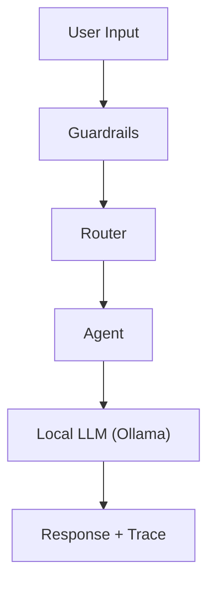

# IntegrityFlow Agent Orchestrator (Local LLM, Free)

IntegrityFlow is a **simple agentic system** built to understand how modern AI systems are designed.  
It runs **fully on a local LLM using Ollama**, so **no paid API keys are required**.

This project focuses on **learning**, **clean architecture**, and **agent orchestration**.

---

## What This Project Does

The system takes a user query and processes it through a clear pipeline:

1. **Guardrails** – validate and block unsafe or risky input  
2. **Router** – decide which agent should handle the query  
3. **Agent** – build a role-specific prompt  
4. **Local LLM (Ollama)** – generate the response  
5. **Tracing** – record what happened at each stage  

---
## ✨ Features

- Runs fully on a **local LLM** (Ollama)
- **No API keys** needed
- Clear agent pipeline (guardrails → router → agent → LLM → trace)
- Easy to extend with new agents
- Safe input checking using guardrails
- Very simple codebase for learning
- CLI experience out of the box
- Full tracing of every step

## Why This Project Exists

This project demonstrates:

- how to build an agentic system from scratch  
- separation of concerns (core logic vs agents vs data)  
- safe input handling using guardrails  
- routing requests to specialist agents  
- observability using simple tracing  
- running LLM systems **locally and for free**

It avoids heavy frameworks on purpose, to make the learning clear.

---

## High-Level Flow
```
User Input
↓
Guardrails (allow / block)
↓
Router (coding / explainer / fallback)
↓
Agent (builds prompt)
↓
LLM Client (Ollama)
↓
Response + Trace Events

```

---

## Project Structure
```
src/
app.py # CLI entry point
agents/
base.py # BaseAgent interface
coding_agent.py # Coding specialist agent
explainer_agent.py # Explainer specialist agent
core/
types.py # Pydantic data models
guardrails.py # input validation logic
routers.py # keyword-based routing
llm_client.py # Ollama HTTP client
orchestrator.py # connects all stages
tracer.py # collects trace events
tests/
test_guardrails.py
test_router.py

```

---

## Requirements

- Python **3.10+**
- Ollama installed locally
- A local model pulled (example: `llama3.1:8b`)

---

## Installation

Clone the project and install it:
```bash
git clone https://github.com/anujkumar1997/integrityFlow-agent-orchestrator.git
cd integrityFlow-agent-orchestrator

python3 -m venv .venv
source .venv/bin/activate

pip install -e .
```

### Install Dependencies
```bash
pip install pydantic requests pytest
```
---


## Running the application (CLI)

After installation, run the CLI:
```bash
integrityflow
```


## To exit the program, type:
```bash
exit
```
---


## Configuration
The application connects to a local Ollama server.

Default values:
- Base URL: `http://localhost:11434`
- Model name: `llama3.1:8b`

In the future, these will be configurable using environment variables:

- `INTEGRITYFLOW_OLLAMA_BASE_URL`
- `INTEGRITYFLOW_OLLAMA_MODEL`
- `INTEGRITYFLOW_REQUEST_TIMEOUT_SECONDS`


### Start Ollama and pull a model
```bash
ollama run llama3.1:8b
```


## How to add a new agent

Agents live in `src/agents/`.

To create a new agent:

1. Make a new file in `src/agents/`  
2. Create a class that builds prompts and returns responses  
3. Register it in the orchestrator  
4. Update the router so it can send messages to the new agent

This makes it easy to extend the system.

## How to add a new guardrail

Guardrails live in `src/core/guardrails.py`.

To add a new rule:
1. Create a new check function  
2. Add it to the main guardrails pipeline  
3. Add tests in `tests/test_guardrails.py`

This makes the system safer and easier to maintain.

## Production Notes

This project follows good engineering practices:

- clean separation between modules
- testable components
- tracing for every request
- CLI entrypoint
- local LLM usage

Possible future improvements:
- environment-based configuration
- embedding-based router
- metrics and logging improvements
- web API (FastAPI)


## Example Inputs

- Explain what routing is
- I got a python error and traceback
- drop table users (blocked by guardrails)

## Tracing

Each request produces trace events, such as:
- guardrails status (ok / blocked)
- router decision and confidence
- which agent was used
- fallback or error cases
- Tracing helps understand how the system made decisions.

## 📌 Recruiter Summary

This project shows my understanding of:

- how LLM-based systems are structured  
- how to build an agent pipeline end-to-end  
- how to write clean, modular, and testable code  
- how to design safe and extendable AI systems  
- how to work with local LLMs (Ollama)  

The code is small by design so the architecture is easy to understand.


---

Made with ❤️ for learning and experimentation.  
Feel free to open issues or contribute!

